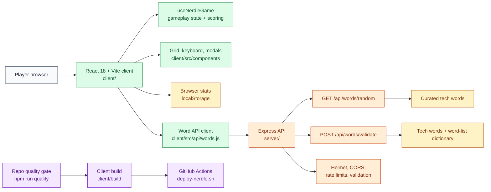
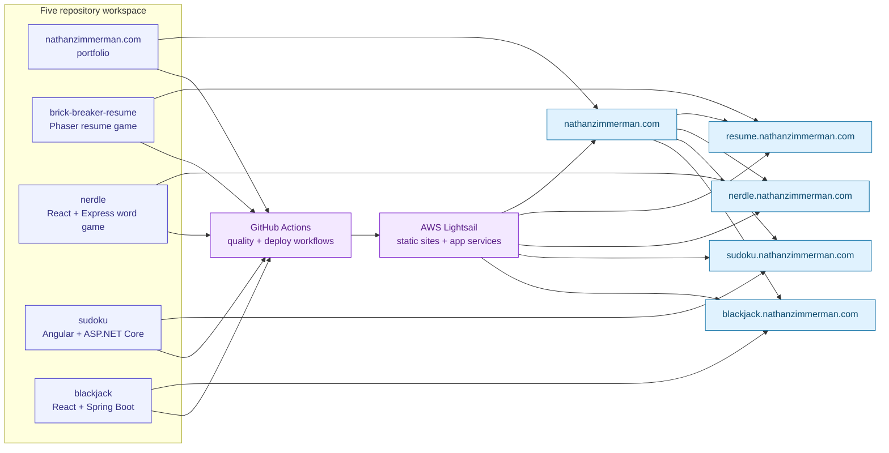

# Architecture

## Runtime Topology

Nerdle is a two-package Node application with a Vite/React client in `client/` and an Express API in `server/`. Local development runs the API on port `4000` and the client on port `3000`, with Vite proxying `/api` calls to the server.

## Architecture Diagram

## Source Boundaries

The client owns gameplay state, rendering, keyboard interaction, modals, local statistics, and API calls. The server owns word selection, guess validation, security middleware, CORS, rate limits, and health checks. Shared quality tooling lives at the repo root.

## Quality Gates

Run `npm run quality` from the repo root after installing root, client, and server npm dependencies. The gate checks Prettier formatting, ESLint, TypeScript `checkJs`, client Vitest coverage, server Jest coverage, and the client production build.

## Deployment Flow

GitHub Actions runs the root quality gate for pull requests and pushes to `main`. Pushes to `main` deploy through a protected production job that SSHes to Lightsail and runs `~/deploy-scripts/deploy-nerdle.sh`, then checks `/` and `/api/health`.

## Workspace Connectivity

## Deferred Architecture Follow-Ups

The browser currently receives the target word for a casual-game tradeoff. A cheat-resistant version should keep the answer server-side and introduce a per-game server session or signed game token.
